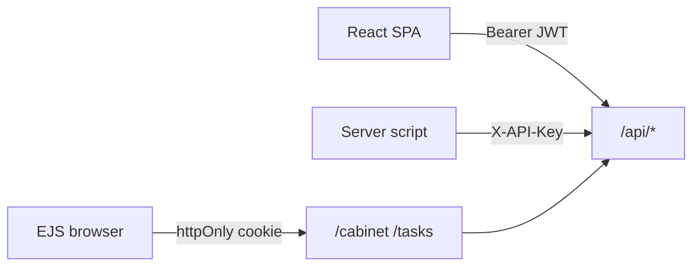

## Исходное задание

> Тщательно распланируй создание в папке `07-myapp` Express-приложения (Node.js 26) с REST API по планированию задач. В качестве БД используй SQLite (Node.js 26 поддерживает SQLite нативно). Основной язык программирования TypeScript версии 6. Приложение должно поддерживать JWT для работы сторонних React-клиентов. В приложении должна быть авторизация/аутентификация/личный кабинет с выдачей ключа api-key для серверной стороны. Внешний интерфейс пусть будет на Tailwind. Приложение должно быть покрыто комментариями и тестами. Глубина детализации не должны быть «бесконечной», нам нужен MVP.

---

# Task Planner MVP

Express-приложение для планирования задач: REST API, JWT для React-клиентов, API-ключи для серверных интеграций, личный кабинет на EJS + Tailwind.

**Стек:** Node.js 22.13+ / 26, TypeScript 6, Express 5, нативный `node:sqlite`, Zod, bcrypt, JWT.

## Требования

- Node.js **>= 22.13** (рекомендуется 26 LTS)
- npm

## Установка

```powershell
cd C:\Users\A\Desktop\NODEJS\07-myapp
npm install
copy .env.example .env
# отредактируйте JWT_SECRET в .env
npm run build
```

## Запуск

```powershell
# разработка (hot reload)
npm run dev

# production
npm run build
npm start
```

Откройте http://localhost:3000 — регистрация, вход, кабинет, задачи.

## Аутентификация



| Канал | Как передать | Для чего |
|-------|--------------|----------|
| JWT | `Authorization: Bearer <token>` | React, Postman, мобильные клиенты |
| API Key | `X-API-Key: sk_...` | Серверные скрипты, CI |
| Cookie | `token` (httpOnly) | Веб-кабинет EJS |

API-ключ создаётся в **Личном кабинете** и показывается **один раз**.

## REST API

Базовый URL: `http://localhost:3000/api`

### Регистрация и вход

```http
POST /api/auth/register
Content-Type: application/json

{ "email": "user@test.com", "password": "secret12" }
```

```http
POST /api/auth/login
Content-Type: application/json

{ "email": "user@test.com", "password": "secret12" }
```

Ответ: `{ "data": { "token": "...", "user": { ... } } }`

### Профиль и API-ключи (JWT)

```http
GET /api/auth/me
Authorization: Bearer <token>
```

```http
POST /api/auth/api-keys
Authorization: Bearer <token>
Content-Type: application/json

{ "label": "My bot" }
```

```http
DELETE /api/auth/api-keys/1
Authorization: Bearer <token>
```

### Задачи (JWT или X-API-Key)

```http
GET /api/tasks
Authorization: Bearer <token>
```

```http
GET /api/tasks
X-API-Key: sk_<ваш_ключ>
```

```http
POST /api/tasks
Authorization: Bearer <token>
Content-Type: application/json

{ "title": "Сделать отчёт", "description": "до пятницы", "dueDate": "2026-05-20" }
```

```http
PATCH /api/tasks/1
Authorization: Bearer <token>
Content-Type: application/json

{ "status": "done" }
```

```http
DELETE /api/tasks/1
Authorization: Bearer <token>
```

### Проверка API (fetch)

Сначала запустите сервер:

```powershell
cd C:\Users\A\Desktop\NODEJS\07-myapp
npm run dev
```

Базовый URL: `http://localhost:3000`. Вставляйте фрагменты в **DevTools → Console** (поддерживается `await`) или выполняйте в **Node.js 18+** (`node` REPL / скрипт с `"type": "module"`).

Подставьте свой ключ вместо плейсхолдера (формат `sk_...` из личного кабинета):

```js
const API_BASE = 'http://localhost:3000/api';
const API_KEY = 'sk_ВАШ_API_KEY'; // плейсхолдер — замените на ключ из кабинета

const apiHeaders = {
  'X-API-Key': API_KEY,
  'Content-Type': 'application/json',
  Accept: 'application/json',
};
```

> **CORS:** запросы с другого origin (например, вкладка на `file://` или другой порт) могут блокироваться. Удобнее всего — консоль на http://localhost:3000 или Node.js без браузера.

**GET — список задач**

```js
const res = await fetch(`${API_BASE}/tasks`, { headers: { 'X-API-Key': API_KEY } });
console.log(res.status, await res.json());
```

**GET — только `todo` или `done`**

```js
const res = await fetch(`${API_BASE}/tasks?status=todo`, {
  headers: { 'X-API-Key': API_KEY },
});
console.log(res.status, await res.json());
```

**POST — создать задачу**

```js
const res = await fetch(`${API_BASE}/tasks`, {
  method: 'POST',
  headers: apiHeaders,
  body: JSON.stringify({
    title: 'Проверка через fetch',
    description: 'из readme',
    dueDate: '2026-05-31',
  }),
});
const body = await res.json();
console.log(res.status, body); // 201 — сохраните body.data.task.id для PATCH/DELETE
```

**GET — одна задача по id**

```js
const taskId = 1; // подставьте id из POST
const res = await fetch(`${API_BASE}/tasks/${taskId}`, {
  headers: { 'X-API-Key': API_KEY },
});
console.log(res.status, await res.json());
```

**PATCH — обновить задачу**

```js
const taskId = 1; // подставьте id из POST
const res = await fetch(`${API_BASE}/tasks/${taskId}`, {
  method: 'PATCH',
  headers: apiHeaders,
  body: JSON.stringify({ status: 'done', title: 'Готово' }),
});
console.log(res.status, await res.json());
```

**DELETE — удалить задачу**

```js
const taskId = 1; // подставьте id из POST
const res = await fetch(`${API_BASE}/tasks/${taskId}`, {
  method: 'DELETE',
  headers: { 'X-API-Key': API_KEY },
});
console.log(res.status); // 204 — тела ответа нет
```

**Полный сценарий (API-ключ)**

```js
const API_BASE = 'http://localhost:3000/api';
const API_KEY = 'sk_ВАШ_API_KEY';

const h = { 'X-API-Key': API_KEY, 'Content-Type': 'application/json' };

let res = await fetch(`${API_BASE}/tasks`, {
  method: 'POST',
  headers: h,
  body: JSON.stringify({ title: 'Сценарий readme' }),
});
let { data } = await res.json();
const id = data.task.id;
console.log('created', res.status, id);

res = await fetch(`${API_BASE}/tasks/${id}`, { headers: { 'X-API-Key': API_KEY } });
console.log('get', res.status, await res.json());

res = await fetch(`${API_BASE}/tasks/${id}`, {
  method: 'PATCH',
  headers: h,
  body: JSON.stringify({ status: 'done' }),
});
console.log('patch', res.status, await res.json());

res = await fetch(`${API_BASE}/tasks/${id}`, { method: 'DELETE', headers: { 'X-API-Key': API_KEY } });
console.log('delete', res.status);

res = await fetch(`${API_BASE}/tasks/${id}`, { headers: { 'X-API-Key': API_KEY } });
console.log('after delete', res.status, await res.json()); // ожидается 404
```

#### JWT (если нужны auth-эндпоинты без API-ключа)

**Вход и сохранение токена**

```js
const API_BASE = 'http://localhost:3000/api';

const res = await fetch(`${API_BASE}/auth/login`, {
  method: 'POST',
  headers: { 'Content-Type': 'application/json' },
  body: JSON.stringify({ email: 'user@test.com', password: 'secret12' }),
});
const { data } = await res.json();
const TOKEN = data.token; // плейсхолдер: подставьте email/пароль своего пользователя
console.log(res.status, data.user);
```

**Профиль и API-ключи (только JWT)**

```js
const jwtHeaders = {
  Authorization: `Bearer ${TOKEN}`, // TOKEN из login выше
  'Content-Type': 'application/json',
};

let res = await fetch(`${API_BASE}/auth/me`, { headers: jwtHeaders });
console.log('me', res.status, await res.json());

res = await fetch(`${API_BASE}/auth/api-keys`, {
  method: 'POST',
  headers: jwtHeaders,
  body: JSON.stringify({ label: 'fetch test' }),
});
console.log('new key', res.status, await res.json()); // data.key — sk_... (показывается один раз)
```

## React-клиент (внешний)

1. `POST /api/auth/login` → сохранить `token`
2. Запросы с `Authorization: Bearer ${token}`
3. В `.env` React: `VITE_API_URL=http://localhost:3000`
4. CORS: `CLIENT_ORIGIN` в `.env` сервера (по умолчанию `http://localhost:5173`)

## Структура проекта

```
src/
  app.ts              # Express + layout EJS
  server.ts           # запуск
  db/                 # node:sqlite, schema.sql
  repositories/       # SQL
  services/           # бизнес-логика
  middleware/         # auth, validate, errors
  routes/api/         # REST JSON
  routes/web/         # EJS страницы
  views/              # шаблоны Tailwind
tests/                # Jest + Supertest
```

## Тесты

```powershell
npm test
```

Покрыты: регистрация/логин, CRUD задач, API-ключи.

## Скрипты

| Команда | Описание |
|---------|----------|
| `npm run dev` | tsx watch |
| `npm run build` | tsc + css + копия schema.sql |
| `npm start` | node dist/server.js |
| `npm test` | Jest |
| `npm run db:migrate` | только миграции |

## Деплой на Selectel VDS

Полная инструкция: [readme2.md](readme2.md).  
Секреты GitHub Actions: [deploy/ACTIONS-SECRETS.md](deploy/ACTIONS-SECRETS.md).

## Ограничения MVP

- `node:sqlite` — синхронный API
- JWT без refresh-токена
- Нет rate limit и email-подтверждения
- Отдельный React-проект не включён — только API + CORS
