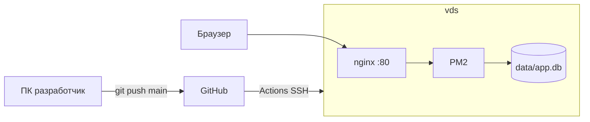

# Доставка Task Planner на Selectel VDS

Пошаговая инструкция для развёртывания [07-myapp](.) на Linux VDS с автодеплоем через GitHub Actions.

**Цель:** приложение доступно по `http://81.163.31.249` (nginx :80 → Node :3000, PM2).

---

## Схема



---

## Что понадобится

| Компонент | Версия / примечание |
|-----------|---------------------|
| VDS | Linux, IP `81.163.31.249`, SSH |
| Node.js на сервере | >= 22.13 |
| GitHub | репозиторий `task-planner`, Secrets для Actions |
| Локально | git, Node 22+, SSH-клиент (опционально) |

Файлы деплоя в репозитории:

- [ecosystem.config.cjs](ecosystem.config.cjs) — PM2
- [.github/workflows/deploy.yml](.github/workflows/deploy.yml) — CI/CD
- [deploy/nginx-task-planner.conf](deploy/nginx-task-planner.conf) — nginx
- [deploy/bootstrap-vds.sh](deploy/bootstrap-vds.sh) — первичная настройка сервера
- [deploy/SSH-SETUP.md](deploy/SSH-SETUP.md) — SSH-ключи без паролей в git

---

## Часть 1. Подготовка репозитория (локально)

### 1.1 Инициализация git

```powershell
Set-Location C:\Users\A\Desktop\NODEJS\07-myapp
git init
git add .
git commit -m "Initial commit: Task Planner MVP + deploy"
```

В git **не** попадают: `node_modules/`, `dist/`, `data/`, `.env`, `deploy/ci_deploy_key` (см. [.gitignore](.gitignore)).

### 1.2 Тесты перед пушем

```powershell
npm ci
npm test
npm run build
```

### 1.3 Репозиторий на GitHub

1. GitHub → **New repository** → имя `task-planner`, без README.
2. SSH-ключ для ПК: [deploy/SSH-SETUP.md](deploy/SSH-SETUP.md) §2.
3. Подключить remote:

```powershell
git remote add origin git@github.com:ВАШ_LOGIN/task-planner.git
git branch -M main
git push -u origin main
```

---

## Часть 2. SSH-ключи (без паролей в CI)

Подробно: [deploy/SSH-SETUP.md](deploy/SSH-SETUP.md).

### 2.1 Ключ GitHub Actions → VDS

На машине с `ssh-keygen` (Git Bash / WSL / Linux):

```bash
ssh-keygen -t ed25519 -f ci_deploy_key -N "" -C "github-actions-task-planner"
```

| Файл | Куда |
|------|------|
| `ci_deploy_key` | GitHub → Repo → Settings → Secrets → `SSH_PRIVATE_KEY` |
| `ci_deploy_key.pub` | VDS → `/home/deploy/.ssh/authorized_keys` |

### 2.2 Deploy key VDS → GitHub (для `git pull`)

На сервере под пользователем `deploy` — см. [SSH-SETUP.md](deploy/SSH-SETUP.md) §3.

### 2.3 Secrets в GitHub Actions

| Secret | Значение |
|--------|----------|
| `SSH_HOST` | `81.163.31.249` |
| `SSH_USER` | `deploy` |
| `SSH_PRIVATE_KEY` | весь текст `ci_deploy_key` |
| `SSH_PORT` | `22` |

---

## Часть 3. Первичная настройка VDS (один раз)

Подключение:

```powershell
ssh root@81.163.31.249
```

### 3.1 Скрипт bootstrap

Скопировать репозиторий на сервер (после clone) или передать скрипт:

```bash
# на сервере от root
bash /var/www/task-planner/deploy/bootstrap-vds.sh /path/to/ci_deploy_key.pub
```

Скрипт [bootstrap-vds.sh](deploy/bootstrap-vds.sh) установит: `git`, `nginx`, `ufw`, Node 22, PM2, пользователя `deploy`, nginx :80.

### 3.2 Ручные шаги (если без скрипта)

```bash
apt update && apt upgrade -y
apt install -y git nginx ufw build-essential curl
ufw allow OpenSSH && ufw allow 80/tcp && ufw enable

curl -fsSL https://deb.nodesource.com/setup_22.x | bash -
apt install -y nodejs
npm i -g pm2

adduser --disabled-password --gecos "" deploy
usermod -aG sudo deploy
# authorized_keys для deploy — см. SSH-SETUP.md

mkdir -p /var/www/task-planner
chown deploy:deploy /var/www/task-planner
```

### 3.3 Clone репозитория

```bash
sudo -u deploy git clone git@github.com:ВАШ_LOGIN/task-planner.git /var/www/task-planner
```

### 3.4 Production `.env`

```bash
sudo -u deploy nano /var/www/task-planner/.env
```

Содержимое (по [.env.example](.env.example)):

```env
PORT=3000
NODE_ENV=production
JWT_SECRET=<openssl rand -base64 32>
JWT_EXPIRES_IN=7d
CLIENT_ORIGIN=http://81.163.31.249
DATABASE_PATH=/var/www/task-planner/data/app.db
```

Сгенерировать секрет:

```bash
openssl rand -base64 32
```

### 3.5 Сборка и PM2

```bash
cd /var/www/task-planner
sudo -u deploy npm ci
sudo -u deploy npm run build
sudo -u deploy pm2 start ecosystem.config.cjs
sudo -u deploy pm2 save
sudo -u deploy pm2 startup systemd
# выполнить команду, которую выведет pm2 startup
```

### 3.6 nginx

```bash
cp /var/www/task-planner/deploy/nginx-task-planner.conf /etc/nginx/sites-available/task-planner
ln -sf /etc/nginx/sites-available/task-planner /etc/nginx/sites-enabled/
rm -f /etc/nginx/sites-enabled/default
nginx -t && systemctl reload nginx
```

---

## Часть 4. Автодеплой (GitHub Actions)

При каждом `push` в `main`:

1. На runner: `npm ci` + `npm test`
2. По SSH на VDS: `git pull` → `npm ci` → `npm run build` → `pm2 reload`

Workflow: [.github/workflows/deploy.yml](.github/workflows/deploy.yml).

Проверка: внесите мелкое изменение, `git push`, на GitHub вкладка **Actions** → зелёный workflow.

`.env` на сервере при деплое **не перезаписывается**.

---

## Часть 5. Проверка

| Проверка | Команда / действие | Ожидание |
|----------|-------------------|----------|
| PM2 | `pm2 status` | `task-planner` online |
| Главная | браузер `http://81.163.31.249/` | страница входа |
| API без ключа | `curl http://81.163.31.249/api/tasks` | `401` |
| API с ключом | заголовок `X-API-Key: sk_...` | `200` + JSON |
| Логи | `pm2 logs task-planner` | без ошибок |
| Повторный деплой | `git push` | Actions success |

Примеры `fetch` — в [readme.md](readme.md#проверка-api-fetch), базовый URL замените на `http://81.163.31.249`.

---

## Часть 6. Бэкап SQLite

База: `/var/www/task-planner/data/app.db` (не в git).

```bash
# пример cron (root)
0 3 * * * cp /var/www/task-planner/data/app.db /var/backups/app-$(date +\%F).db
```

---

## Устранение неполадок

| Симптом | Решение |
|---------|---------|
| Actions: SSH connection failed | Проверить Secrets, `authorized_keys`, `ufw` |
| 502 Bad Gateway | `pm2 status`, приложение слушает 3000 |
| 401 на API | JWT / `X-API-Key` в заголовке |
| Стили не грузятся | `npm run build` (Tailwind → `public/css/app.css`) |
| `Missing required env: JWT_SECRET` | создать `.env` на сервере |

---

## Ограничения MVP

- HTTP без HTTPS на IP — для production позже: домен + Let's Encrypt.
- Один процесс PM2, SQLite — без кластера.
- Секреты только в `.env` и GitHub Secrets, не в репозитории.

---

## Краткий чеклист повторного деплоя с нуля

1. [ ] `git push` в `main` на GitHub
2. [ ] Secrets: `SSH_HOST`, `SSH_USER`, `SSH_PRIVATE_KEY`
3. [ ] VDS: Node 22, PM2, nginx, пользователь `deploy`
4. [ ] Clone в `/var/www/task-planner`, `.env`, `npm run build`, `pm2 start`
5. [ ] Deploy key на GitHub для `git pull` с сервера
6. [ ] Открыть `http://81.163.31.249/`, проверить API
